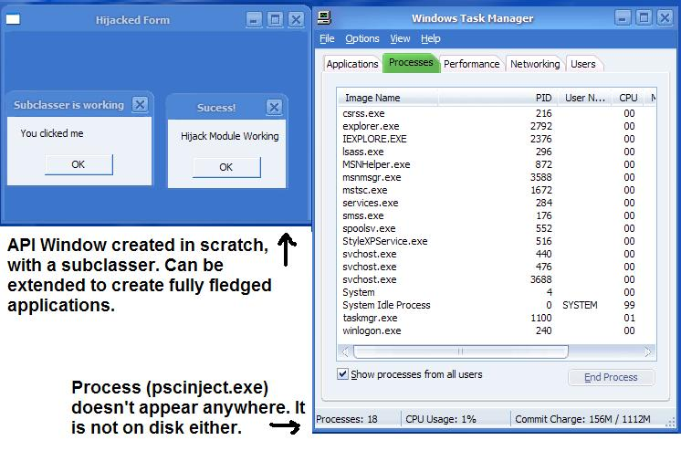



## Delete a file in use \- Run an EXE Hidden \- Run code in other process' memory \*NEW VERSION\*

### Description

Hi everyone, the code is back in Version 2.0 and better then ever! You can now insert your code into Explorer, thus removing the need for compiling a separate special application. You can also create forms, subclass them, and call some (not all) VB functions, as well as use all API and previous modules in your code. This code will create a sample window and then delete itself. However it won't kill the thread, so if you run it again, make sure you kill/restart explorer. Once the code is run, the application will appear NOWHERE. It is also possible to use this method in order to Hook system API calls, which is what I'll be working on for next month. Thanks for your votes last month, I hope you like this new version even better! (Still need compile controller, it's included, read the module for more information)
 
### More Info
 

             |
---                |---
**Submitted On**   |2003-05-01 18:39:44
**By**             |[Ion Alex Ionescu](https://github.com/Planet-Source-Code/PSCIndex/blob/master/ByAuthor/ion-alex-ionescu.md)
**Level**          |Advanced
**User Rating**    |4.8 (305 globes from 63 users)
**Compatibility**  |VB 5\.0, VB 6\.0
**Category**       |[Windows API Call/ Explanation](https://github.com/Planet-Source-Code/PSCIndex/blob/master/ByCategory/windows-api-call-explanation__1-39.md)
**World**          |[Visual Basic](https://github.com/Planet-Source-Code/PSCIndex/blob/master/ByWorld/visual-basic.md)
**Archive File**   |[Delete\_a\_f158250532003\.zip](https://github.com/Planet-Source-Code/ion-alex-ionescu-delete-a-file-in-use-run-an-exe-hidden-run-code-in-other-process-memory-n__1-45195/archive/master.zip)

